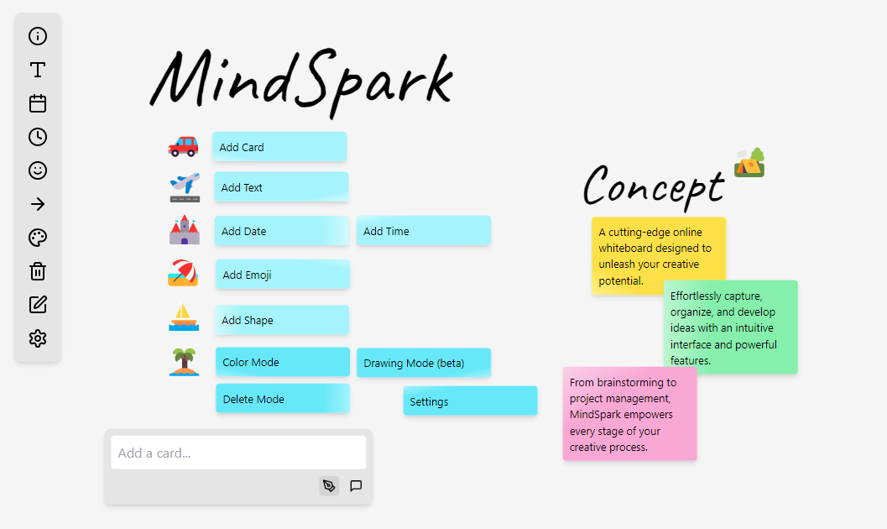

# ✨MindSpark： Whiteboard App

✨MindSparkは、あなたのアイデアを自由に描き、整理し、発展させるための革新的なオンラインホワイトボードアプリです。直感的なインターフェースと多彩な機能で、ブレインストーミングからプロジェクト管理まで、あらゆる創造的プロセスをサポートします。

[https://230327tokiex.github.io/mindspark_whiteboard_public/](https://230327tokiex.github.io/mindspark_whiteboard_public/)

## 特徴

- モダンで使いやすいユーザーインターフェース
- テキスト、カード、絵文字、図形を自由に配置
- 柔軟なカスタマイズオプション（テーマ、絵文字セット、フォントなど）
- 手書き機能でアイデアをすばやくスケッチ（ベータ版）
- ローカルストレージによるデータ保存

## 使い方

### Toolbar
- Add Text：ホワイトボードにテキストボックスを作成し、自由に文章を入力できます
- Add Date：現在の日付をホワイトボードに挿入します
- Add Time：現在の時刻をホワイトボードに挿入します
- Add Emoji：様々な絵文字セットから選択してホワイトボードに追加できます
- Color Mode：選択したカードの色を変更するモードに切り替えます
- Delete Mode：クリックした要素を簡単に削除するモードを開始/終了します
- Drawing Mode (beta)：マウスやタッチデバイスで自由に描画できるモードです（ベータ版）
- Quick Save：ホワイトボードの状態を保存します（SettingにSave and Loadあり）
- Settings：アプリの外観や動作をカスタマイズするメニューを開きます

### Whiteboard
- 要素のドラッグ＆ドロップで自由に配置
- テキストのダブルクリックで編集

### ChatInput(Card)

- Card Mode：カードを追加します

### 設定
- カードテーマ：カードの色をカスタマイズ
- 絵文字セット：好みの絵文字パックを選択
- フォントサイズ・ファミリー：テキストの見た目を調整
- サイズ：ボード、カードのサイズをカスタマイズ
- 手書きの色：描画色を変更
- データのセーブ・ロード・削除：作業内容の管理

## 今後の開発予定

- AI チャットモード（開発中）

## 技術スタック

- React
- TypeScript
- Tailwind CSS
- Vite (ビルドツール)
- Perfect Freehand (手書き機能)
- Lucide React (アイコン)
- React DnD (ドラッグ＆ドロップ)
- React Resizable (要素のリサイズ)
- React Draggable (要素のドラッグ)

## 履歴

- v0.1.0 (2024-08-02): 初期ベータ版リリース
- v0.1.1 (2024-08-04): アップデート

## ライセンス

[MIT](https://choosealicense.com/licenses/mit/)